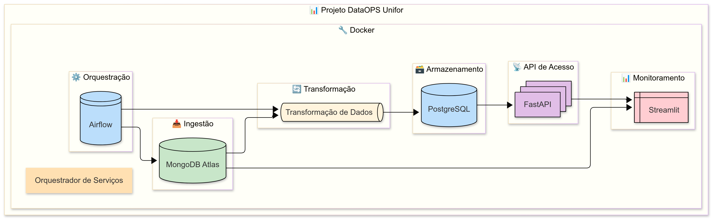

# 🚀 **Projeto DataOps Unifor**

      

O **Projeto DataOps Unifor** é um projeto de engenharia de dados que orquestra pipelines de dados, realiza transformações de forma sequencial e oferece visualizações dinâmicas e interativas. O projeto integra várias tecnologias para criar um fluxo de trabalho completo e automatizado de dados.

## 🎯 **Objetivo do Projeto**

De forma geral, o objetivo principal é automatizar o fluxo de dados através de pipelines orquestrados pelo **Apache Airflow** e utilizando containers **Docker** para isolar os serviços e garantir escalabilidade e eficiência. A solução final inclui:

* **Orquestração de Dados**: Gerenciamento de pipelines e execução automática de tarefas.
* **Transformações em Tempo Agendado**: Processamento de dados em forma de tarefas agendadas.
* **Visualização de Dados**: Dashboards interativos para monitoramentos e insights rápidos.

---

## 📋 **Diagrama do projeto**

- **Diagrama de alto nível explicando o desenho das integrações entre as tecnologias:**

    

---

## 🛠 **Tecnologias e Ferramentas**

Este projeto utiliza um conjunto robusto de tecnologias para garantir a automação, escalabilidade e facilidade de uso:

* **Docker**: Containerização dos serviços para maior flexibilidade e isolamento.
* **Apache Airflow**: Orquestração de workflows e agendamento de tarefas.
* **MongoDB Atlas**: Banco de dados NoSQL para dados não estruturados.
* **PostgreSQL**: Banco de dados relacional para persistência de dados estruturados.
* **FastAPI**: Framework rápido e moderno para a construção de APIs RESTful.
* **Streamlit**: Framework para criação de dashboards interativos.
* **Redis**: Sistema de gerenciamento de cache e filas no Airflow.
* **Poetry**: Gerenciamento eficiente de dependências Python.

---

## 🗂 **Organização da Estrutura do Projeto**

A estrutura do projeto foi organizada para ser intuitiva e modular, facilitando a navegação e o desenvolvimento.

```plaintext
.
├── config                       # Arquivos de configuração do Airflow
├── dags                         # DAGs do Airflow para orquestração
│   ├── dag_gerar_dados.py       # Geração de dados
│   ├── dag_vendas_ano_mes.py    # Processamento de vendas por ano e mês
│   ├── dag_vendas_estado.py     # Processamento de vendas por estado
│   └── dag_vendas_modalidade.py # Processamento de vendas por modalidade
├── dataops_unifor               # Módulo principal
├── docker                       # Configurações Docker para FastAPI e Streamlit
├── docs                         # Documentação adicional
├── logs                         # Logs do Airflow
├── plugins                      # Plugins customizados do Airflow
├── src                          # Código-fonte do projeto
│   ├── fastapi_app              # Aplicação FastAPI
│   └── streamlit_dashboard      # Dashboard Streamlit
└── tests                        # Testes do projeto
└── .env                         # Configurações de variáveis de ambiente
├── docker-compose.yaml          # Orquestração dos containers
├── poetry.lock                  # Bloqueio de dependências
├── pyproject.toml               # Configuração do Poetry
└── README.md                    # Este arquivo
```

---

## 📝 **Como Rodar o Projeto**

### 1. **Instalar Dependências**

Certifique-se de que o **Docker** e o **Docker Compose** estão instalados. Se não, instale-os [aqui](https://www.docker.com/get-started).

Clone o repositório e instale as dependências com o **Poetry**:

```bash
git clone https://github.com/felipealvss/projeto_dataops.git
cd projeto_dataops
poetry install --no-root
```

### 2. **Subir os Containers Docker**

Suba todos os containers definidos no arquivo `docker-compose.yaml`:

```bash
docker-compose up --build
```

Isso irá iniciar os seguintes serviços:

* **PostgreSQL**: Banco de dados relacional.
* **Redis**: Gerenciador de filas para o Airflow.
* **Airflow**: Orquestração de tarefas (DAGs).
* **FastAPI**: API backend.
* **Streamlit**: Dashboard interativo.

### 3. **Acessar os Serviços**

* **Airflow Web UI**: [http://localhost:8080](http://localhost:8080)
* **FastAPI**: [http://localhost:8000](http://localhost:8000)
* **Streamlit**: [http://localhost:8501](http://localhost:8501)

### 4. **Executar os DAGs**

Os DAGs podem ser visualizados e executados através da interface web do Airflow. Os DAGs disponíveis são:

* **dag\_gerar\_dados.py**: Geração e ingestão de dados.
* **dag\_vendas\_ano\_mes.py**: Processamento de vendas por ano e mês.
* **dag\_vendas\_estado.py**: Processamento de vendas por estado.
* **dag\_vendas\_modalidade.py**: Processamento de vendas por modalidade.

### 5. **Interagir com o painel Streamlit**

O painel Streamlit possui 3 botões que interagem diretamente com as rotas disponíveis da API:

* **Vendas por Modalidade**: Informação agrupada de vendas por modalidade de pagamento.
* **Vendas por Cidade**: Informação agrupada de vendas por cidade.
* **Vendas por Ano/Mês**: Informação agrupada de vendas por ano/mês.

---

## ⚙ **Estrutura do `docker-compose.yaml`**

Este arquivo orquestra os serviços Docker. Ele inclui:

* **Airflow**: Configuração dos containers para o `webserver`, `scheduler`, `worker`, `dag-processor`, e `triggerer`.
* **PostgreSQL**: Banco de dados relacional utilizado pelo Airflow.
* **Redis**: Broker de filas para o Airflow.
* **FastAPI e Streamlit**: Containers para o backend e visualização de dados.

---

## 🧪 **Como Testar**

O projeto inclui testes automatizados. Atualmente, os testes cobrem a API **FastAPI** e podem ser executados com:

```bash
python tests/test_api.py
```

---

## 🤝 **Contribuição**

Contribuições são sempre bem-vindas! Para contribuir:

1. Faça um **fork** deste repositório.
2. Crie uma nova branch para sua feature:
   `git checkout -b feature/nome-da-feature`
3. Faça as alterações e adicione um commit:
   `git commit -am 'Adicionando nova feature'`
4. Faça o push para sua branch:
   `git push origin feature/nome-da-feature`
5. Abra um **Pull Request** explicando as mudanças.

---

## 📄 **Licença**

Este projeto está licenciado sob a **MIT License**. Veja o arquivo [LICENSE](LICENSE) para mais detalhes.

---
